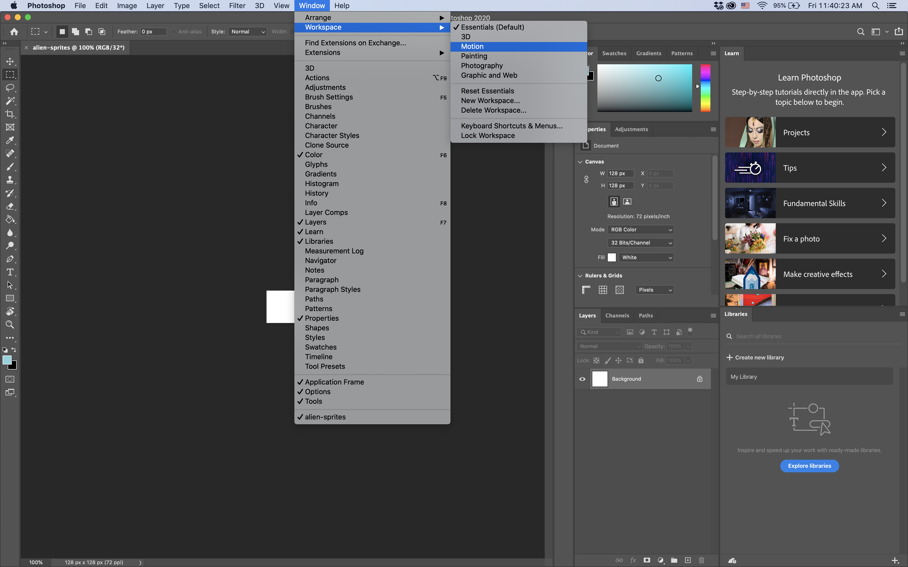

# Setting Up Out Photoshop File
## 1.1 Open Photoshop, and click "Create new"  

## 1.2 Define New Document Settings

### Note: 
We're setting our canvas size to 128 wide by 128 high. This will be the dimensions of each sprite in the sheet.  
We are also setting the units to pixels, and the resolution to 72. A resolution of 72 will ensure that the pixel size we use in Photoshop will be retained when exporting. You can look at it as "true" resolution.

### Hit create when you've set your desired dimensions.

## 1.3 Select the "Motion" Workspace

## 1.4 Click "Create Video Timeline"

## 1.5 Create a New Layer

### Note:
We don't want to draw on our background layer (layer 0).  
This is why we create a new layer.

## 1.6 Select Layer 1, Scrub to the 1-Frame Mark on the Timeline, then Click the Scissor Icon

### Note:
This will split our selected layer at the playhead (The little blue pick + red line).

## 1.7 Click and Drag Layer 1 Copy Into the Same Track as Layer 1

### Note:
This will create a Video Group, which is a sequential set of layers designed to make up an animation.

## 1.8 Use the Scissor Tool to Cut Out Additional Frames

### Note:
Our example sprite sheet has 9 frames, so we've cut out 9 layers.  

## 1.9 Rename Your Video Group

### Note:
We want to name our layers and groups as descriptively as possible.
In this case, we can simply name is frames, but we encourage you to be more descriptive in your own projects.

# Next Step: Drawing
Now that we've set up our Photoshop file, we are ready to start putting our sprite animation together.  
Make sure to save your file (with a descriptive name, of course), then move on to [step 2](step2.md).