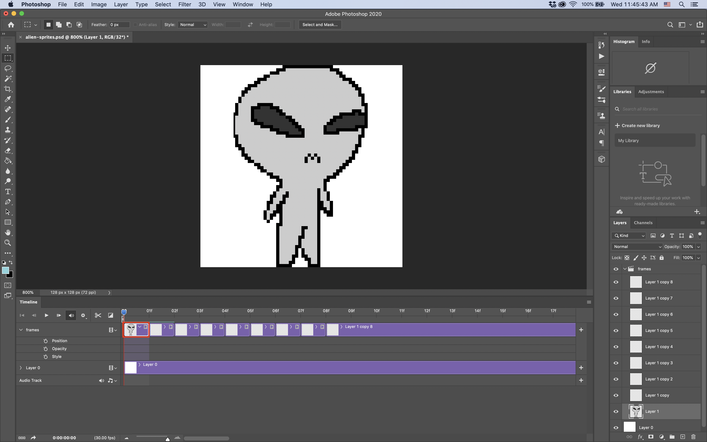
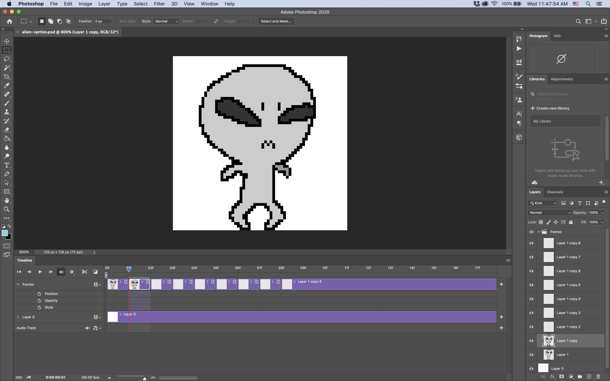
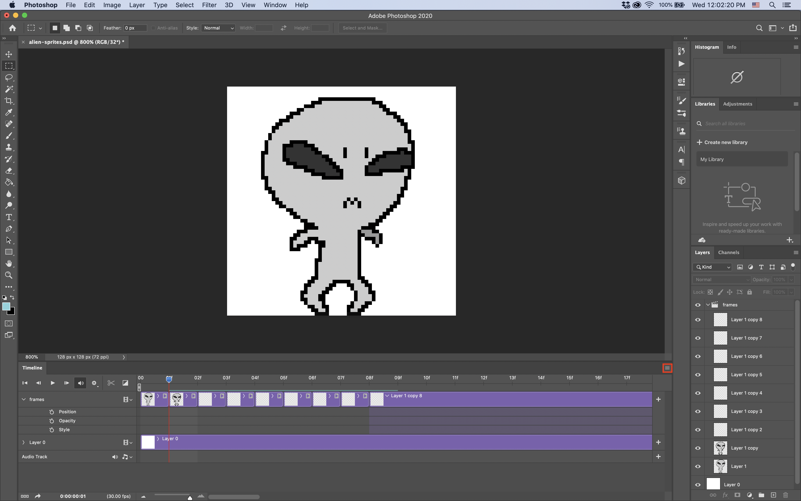
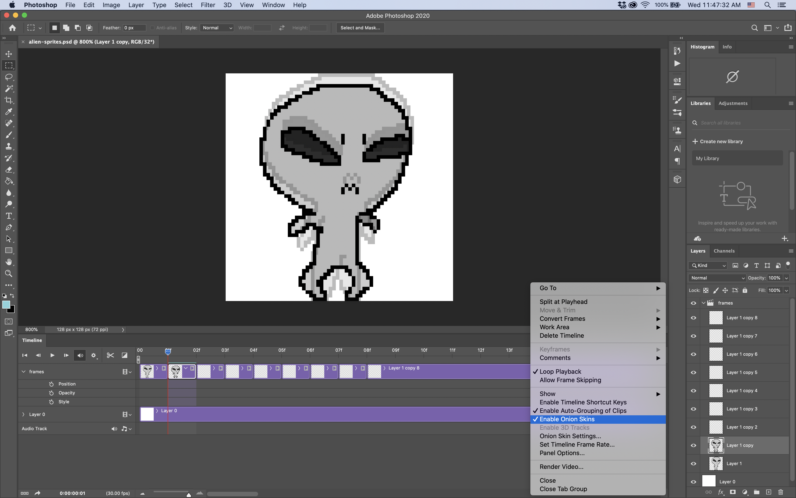
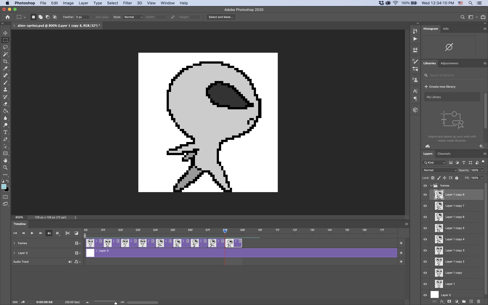

# Drawing Sprites
### This is not a Photoshop tutorial.
Hopefully, you have some experience with bitmap drawing software. (Think MS Paint.)  
This will be one of the most brief steps in our tutorial.

## 2.1 Draw Your First Sprite Frame on the First Layer in the Timeline

### Note:
Make sure you have the layer you're trying to draw on selected in either the Timeline or Layers window! 

## 2.2 Draw the Next Frame on the Next Layer, and So Forth

## 2.3 Enable Onion Skins to Make Sure Frames are Positioned Relatively

### Select the little hamburger menu on the Timeline panel, highlighted below.

### Select "Enable Onion Skins" from the pop-up menu.

### Note:
Onion skins allow us to see a transparent preview of frames before and/or after the presently viewed frame.  
This allows us to position each frame relative to our initial frame for consitency.  
You can adjust how many onion skin frames are shown by selecting "Onion Skin Settings..." in the Timeline menu shown above. 

## 2.4 Finish Adding Frames

# Next Step: Exporting
If you're done with each frame of your animation, you're ready to export your frames.  
We'll cover how to do this in [step 3](step3.md).