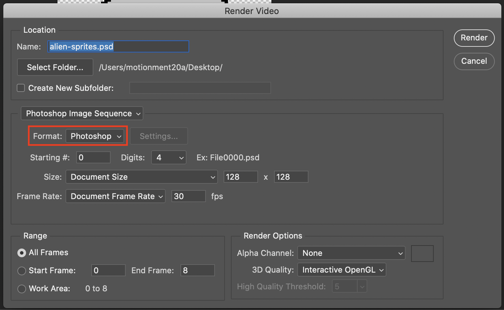

# Exporting Our Frames
## 3.1 Make Sure Your Document Color Mode is RGB, 8-bit or 16-bit

### Note:
We were coloring in 32-bit before, but changing the document color mode this far in will reduce the number of colors in our images, so in the future, it's best to change this before drawing.

## 3.2 Open the Timeline Menu and Select "Render Video..."

## 3.3 Set Renderer Settings
### 3.3.1 Change the Export Codec to "Photoshop Image Sequence"

### 3.3.2 Change the Format to "PNG"

### 3.3.3 Set the Alpha Channel to "Straight - Unmatted"

### 3.3.4 Choose an Output Folder and Press Render

### Note:
You should have a folder made for storing these assets, but for the sake of simplicity we're just exporting to our desktop.  
We recommend against doing this in your own projects. 

## 3.4 Choose a File Compression Size

### Note:
We're using the largest file size for this example, but your situation may call for a smaller file size.  
You should use your own judgement when deciding which compression method to use. 

# Next Step: Generating Our Sprite Sheet
If the above steps were followed correctly, your frames should be in the chosen folder like so:

If you have your frames as expected, move on to [step 4](step4.md).
