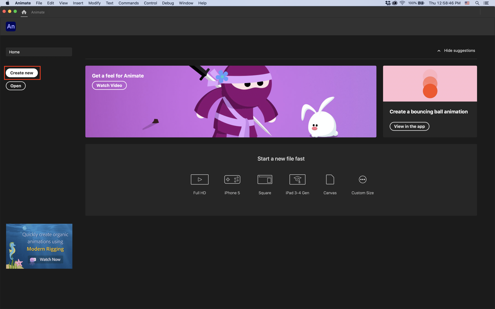
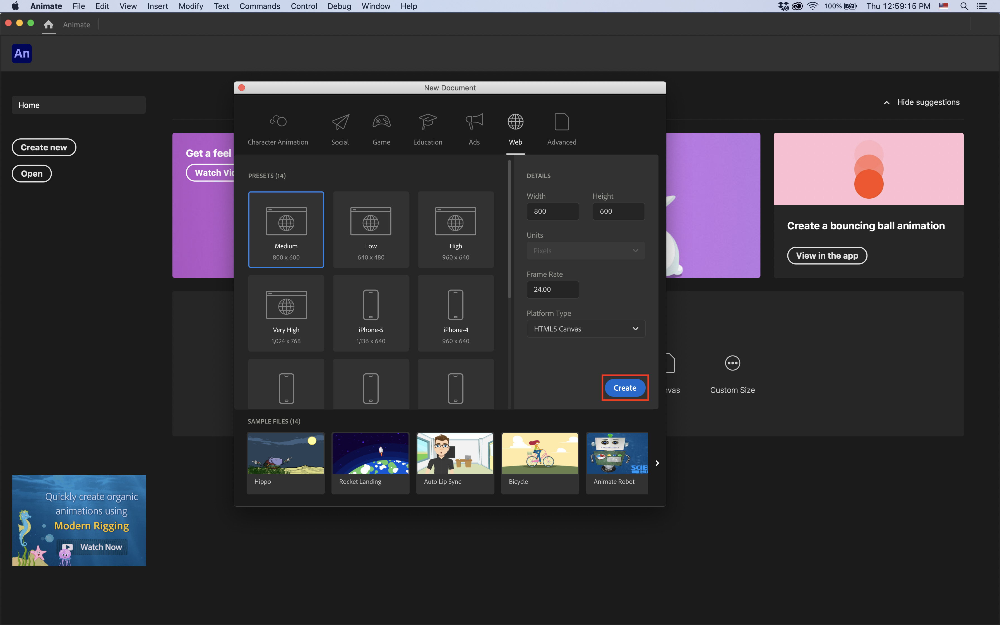
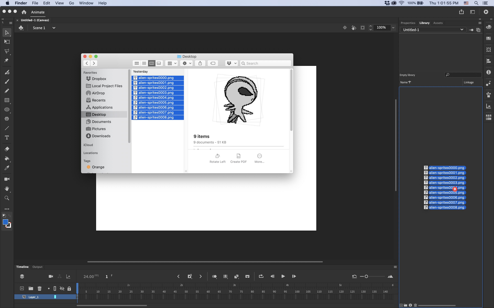
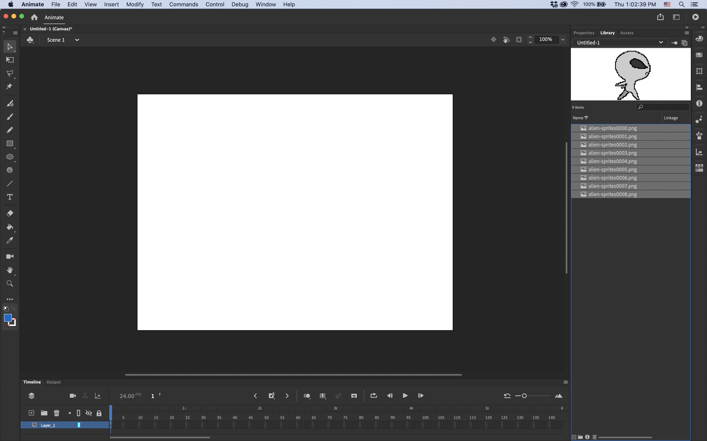
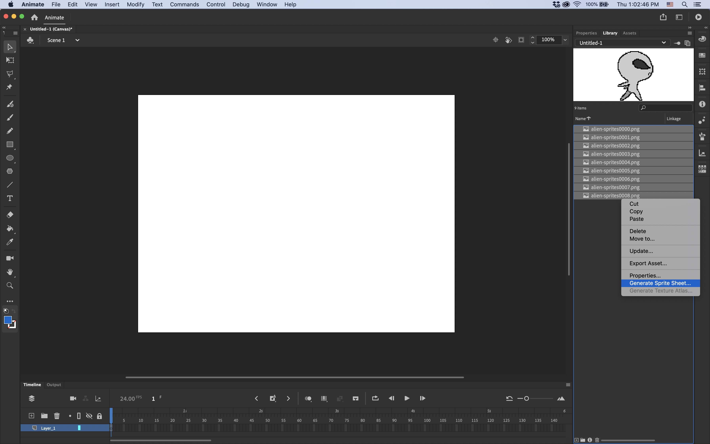
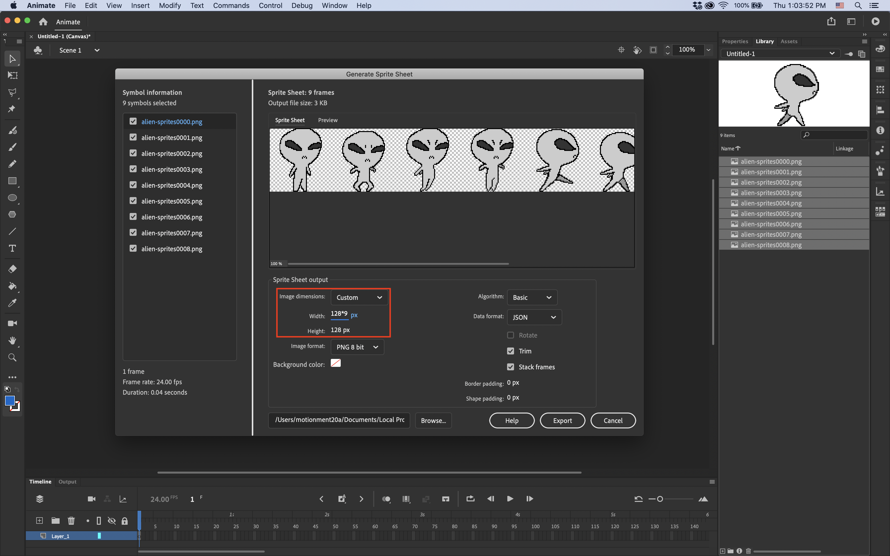
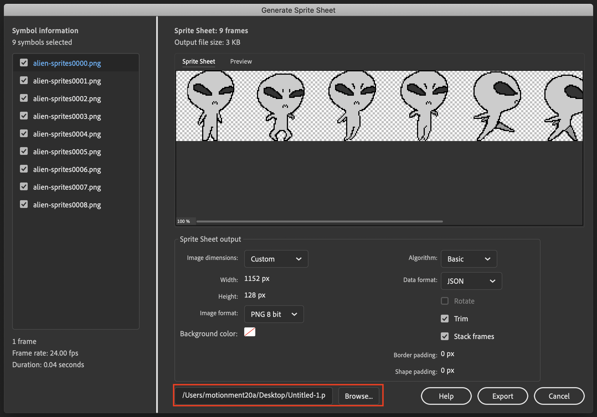
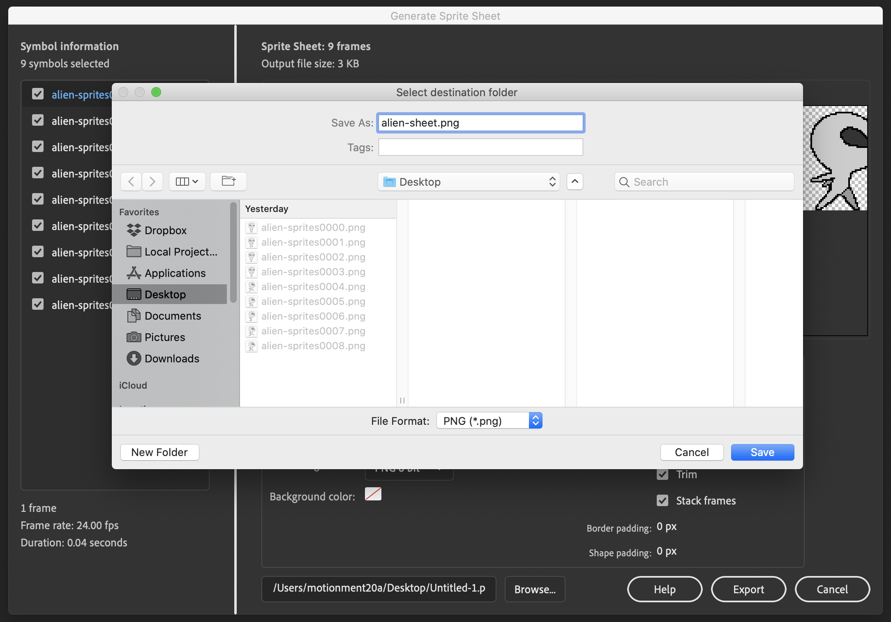
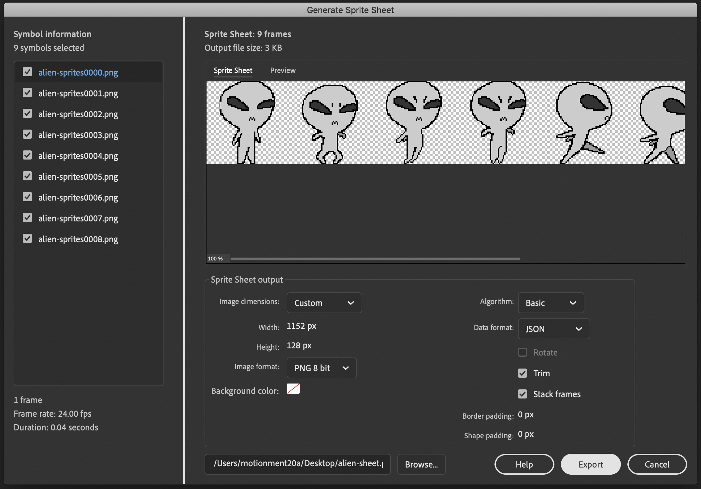
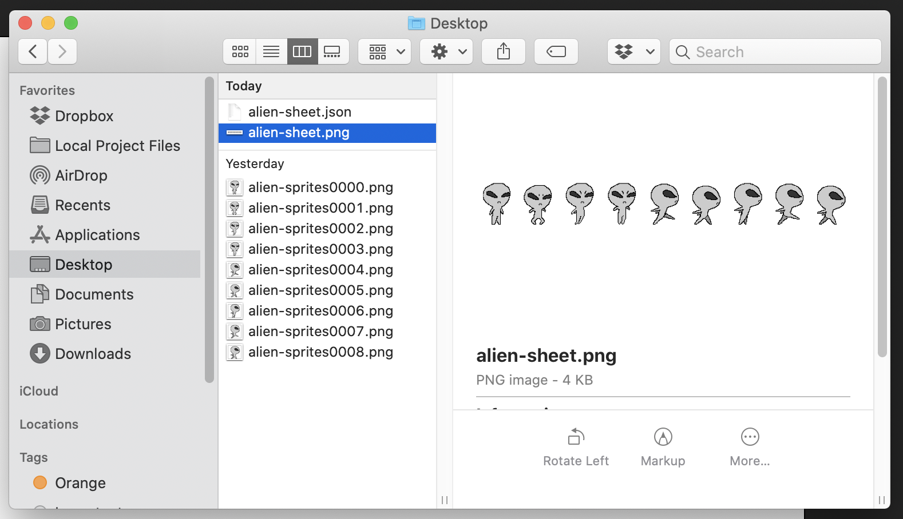

# Generating Sprite Sheets With Adobe Animate
## 4.1 Open Adobe Animate and Click "Create New"

## 4.2 Click "Create"

## Note:
We're not gonna be doing any real work in Animate, so don't worry about the document settings too much.
The default should be just fine.

## 4.3 Drag Your Sprite Frames From Your OS Folder into the Library Panel in Animate

## 4.4 Select All of Your Frames in the Library Panel

## 4.5 Right-Click on the Selected Layers and Select "Generate Sprite Sheet..."

## 4.6 Set Sprite Sheet Dimensions

### Note:
Remember how each sprite was 128 by 128?  
This is why I set the height of the sheet to 128.  
For the width, I simply multiply the width of one sprite by the number of sprites.  
In this case, 128 * 9. You can punch equations into most numeric fields in Adobe software.  
You should try it out!

## 4.7 Select Output Folder and Filename

### Note:
We're exporting to desktop again for simplicity only!

## 4.9 Hit Export

# The Final Product
If everything above is done correctly, you should now have a strip-shaped sprite sheet in your folder:

A .json file will also be created, which some game engines like Unity require with their sheets.
If your folder looks the same as above, you've created your sheet! Good work.